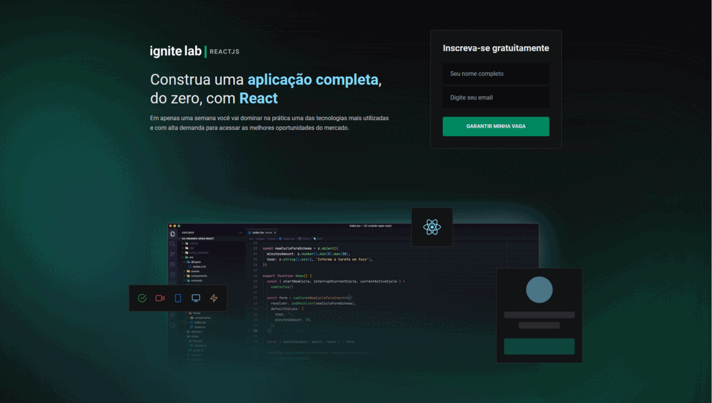

# 📖 Projeto

O projeto foi desenvolvido durante a semana do IgniteLab, evento realizado pela Rocekseat com o intuito de difundir conhecimentos avançados em React.js utilizando tecnologias como GraphQL, GraphCMS, TypeScript e Vite. O projeto consiste em uma plataforma de aulas, muito similar a que foi usada durante o evento, onde o usuário tem acesso a uma nova aula por dia da semana.

# 🌟 Milha extra (desenvolvido por iniciativa própria)
- Layout Responsivo

## 🧪 Tecnologias

[](https://skillicons.dev)

## 🚀 Como executar

Para inicializar o projeto localmente siga os passos descritos abaixo:

```bash
# Clone o repositório
$ git clone https://github.com/d0ugui/ignite-lab

# Entre no repositório
$ cd ignite-lab

# Instale as dependências
$ npm install or yarn

# Crie a variável ambiente
$ .env.local / VITE_API_URL

# Execute a aplicação
$ npm run dev or yarn dev
```

## 📝 License

Esse projeto está sob a licença MIT.
